# Popflix - [Netflix + Popcorntime]

A netflix clone made on Flutter using API provided by [Popcorntime](https://github.com/popcorn-official). State managed using Provider amd will be changing UI soon.

NOTE : Its kind of Torrent client, currently using [flutter_torrent_streamer](https://pub.dev/packages/flutter_torrent_streamer) plugin to play Torrent magnet link. This plugin is based on [TorrentStream](https://github.com/TorrentStream/TorrentStream-Android). 

Works only on Android for now. It Still have lots of silly known issues, help me to resolve them by creating issues Or by providing PR's. Any kind of PR is welcome.

Docs for PopcornTime APIs : https://popcorntime.api-docs.io/api/welcome/introduction (Base URL is not the same now)

## APK
Please download latest apk from Github Releases : https://github.com/iamSahdeep/popflix/releases

Previews in GIFs : [Preview 1](https://github.com/iamSahdeep/popflix/blob/master/screenshots/p2.gif), [Preview 2](https://github.com/iamSahdeep/popflix/blob/master/screenshots/p3.gif), [Preview 3](https://github.com/iamSahdeep/popflix/blob/master/screenshots/p2.gif)

## ScreenShots

<p align="center">
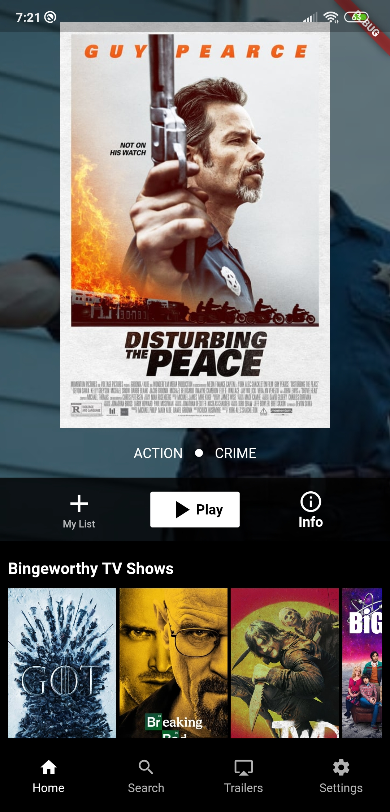 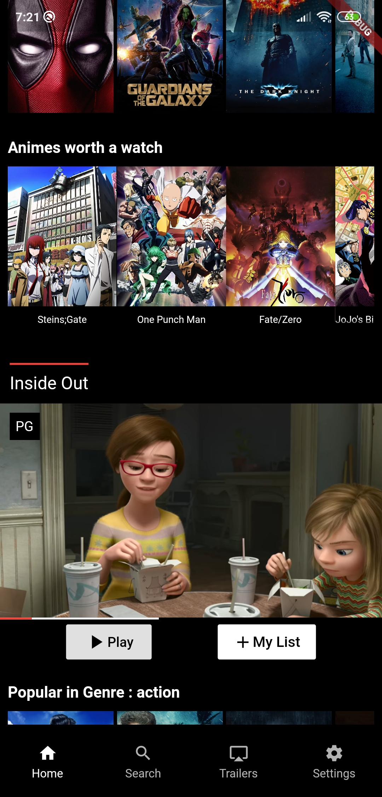 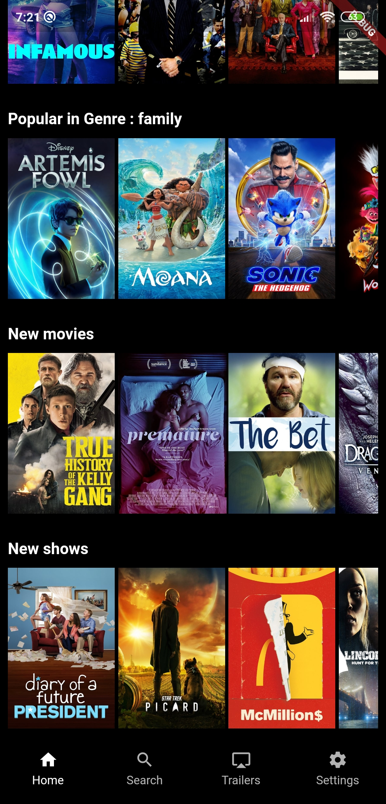 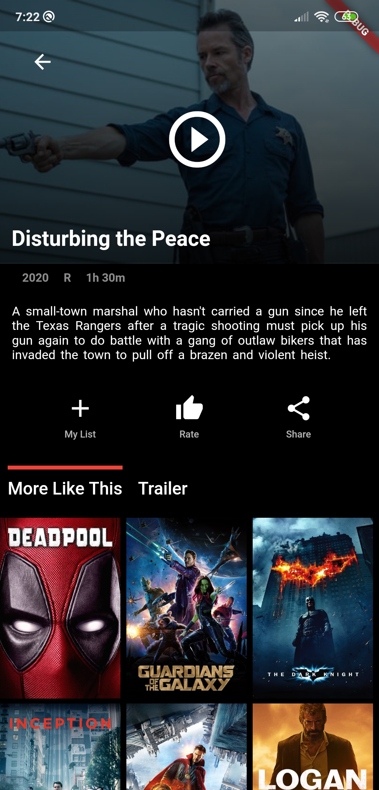 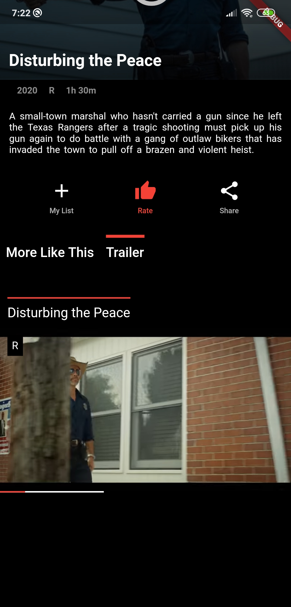 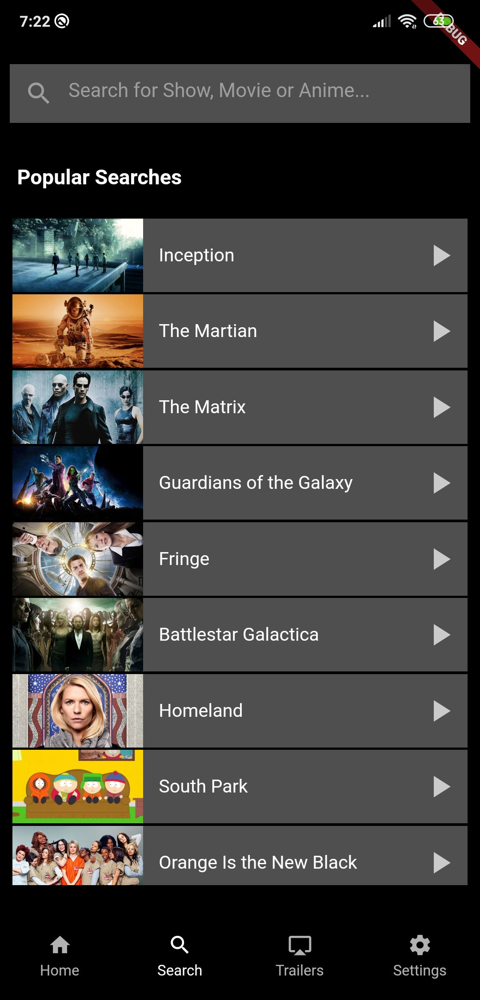 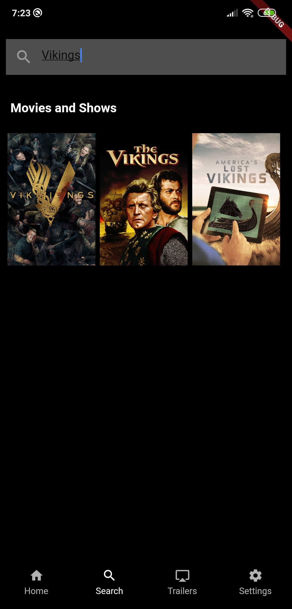  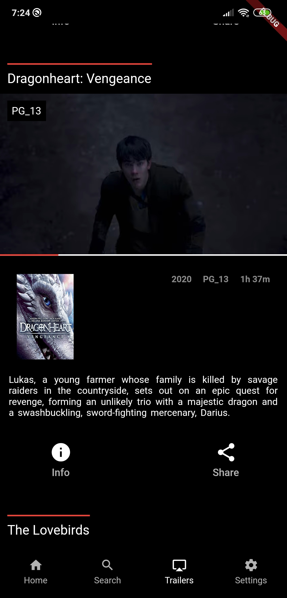 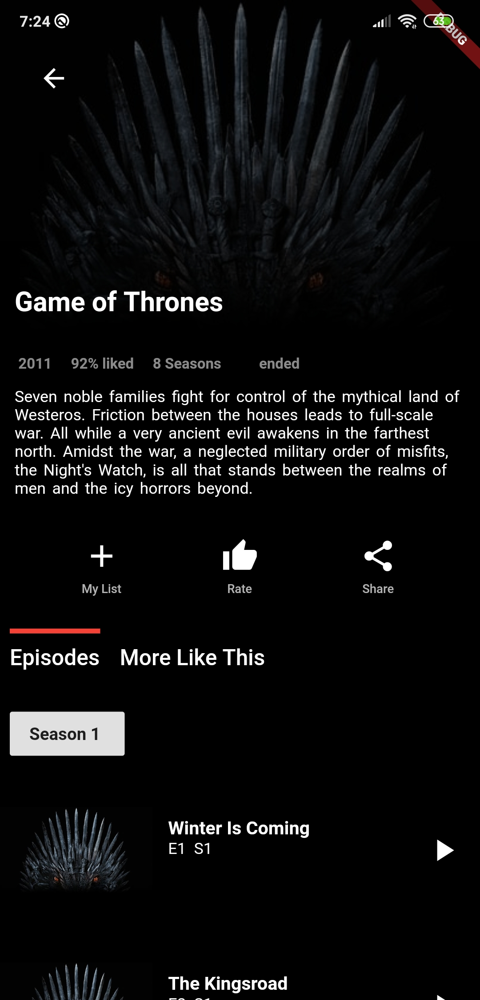 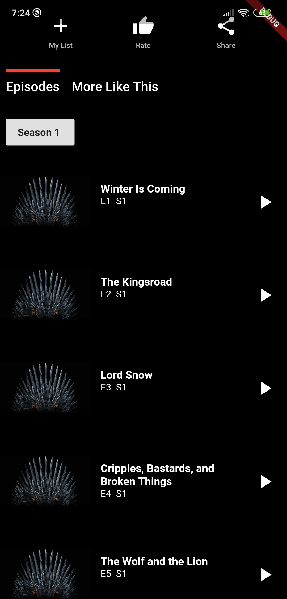 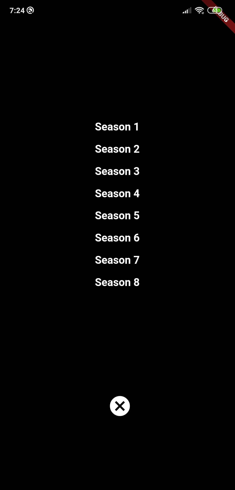 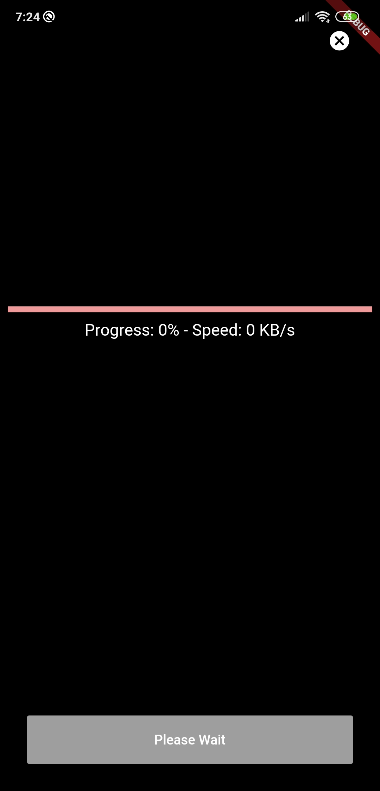 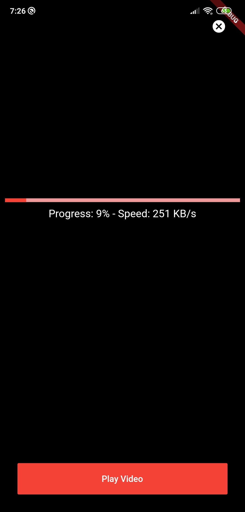 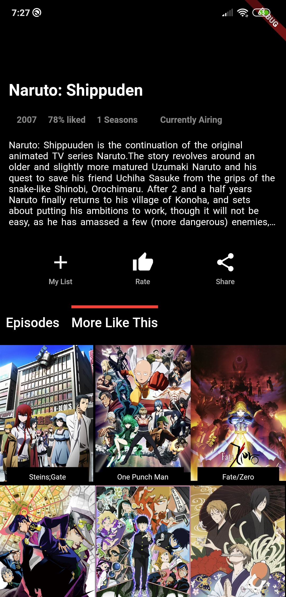
</p>

# Features

Features included but not limited to : 
  - Backed by PopcornTime with every show, movie or anime available.
  - Trailers Tab to watch trailers of newly release movies or shows.
  - Search from the ocean of data from search tab.
  - Popular Shows, movies and Animes right on Main Screen.
  - Random Trailer just like original Netflix in MainScreen.
  - RunTime No Internet Screen
  
Soon will be adding more features help me to create them. PR's of any kind is welcome :)

## Credits
I have used alot of plugins to make it work and credits goes to them. Please find all the plugins used in [pubsec.yaml](https://github.com/iamSahdeep/popflix/blob/master/pubspec.yaml)
  
## License
```
MIT License

Copyright (c) 2020 Sahdeep Singh

Permission is hereby granted, free of charge, to any person obtaining a copy
of this software and associated documentation files (the "Software"), to deal
in the Software without restriction, including without limitation the rights
to use, copy, modify, merge, publish, distribute, sublicense, and/or sell
copies of the Software, and to permit persons to whom the Software is
furnished to do so, subject to the following conditions:

The above copyright notice and this permission notice shall be included in all
copies or substantial portions of the Software.

THE SOFTWARE IS PROVIDED "AS IS", WITHOUT WARRANTY OF ANY KIND, EXPRESS OR
IMPLIED, INCLUDING BUT NOT LIMITED TO THE WARRANTIES OF MERCHANTABILITY,
FITNESS FOR A PARTICULAR PURPOSE AND NONINFRINGEMENT. IN NO EVENT SHALL THE
AUTHORS OR COPYRIGHT HOLDERS BE LIABLE FOR ANY CLAIM, DAMAGES OR OTHER
LIABILITY, WHETHER IN AN ACTION OF CONTRACT, TORT OR OTHERWISE, ARISING FROM,
OUT OF OR IN CONNECTION WITH THE SOFTWARE OR THE USE OR OTHER DEALINGS IN THE
SOFTWARE.

```
# Author & support
This project is created by [Sahdeep Singh](https://github.com/iamSahdeep) but with lots of support and help. See credits.
> If you appreciate my work, consider buying me a cup of :coffee: to keep me recharged :metal:
>  + [PayPal](https://www.paypal.me/sahdeep)
>
> Or you can also endorse me on [LinkedIn](https://www.linkedin.com/in/iamsahdeep/) to keep me motivated.
>
>For anything just ping me on my email: sahdeepsingh98@gmail.com Or find me with @iamSahdeep on almost every socialmedia. 


